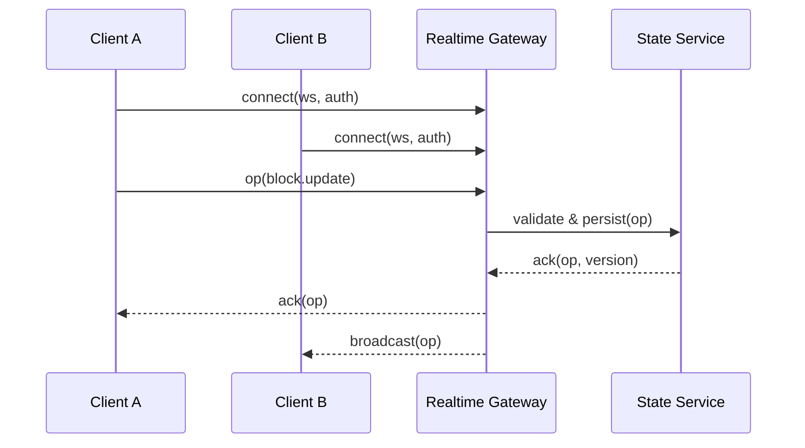

> This post outlines the key pieces of Sim’s realtime and multiplayer stack. It’s a scaffold we’ll keep enriching with diagrams, traces, and code snippets as we publish more details.

## Goals

- Low‑latency collaboration on shared canvases and workflows  
- Deterministic conflict resolution and auditability  
- Scales from small teams to enterprise orgs  

## High‑level architecture

1. Transport  
   - Secure WebSocket channels per workspace/session with fallbacks.  
2. Session and presence  
   - Authenticated connections; presence, cursors, and selections broadcast on a lightweight channel.  
3. State model  
   - Canonical workflow state stored in a durable DB; clients hold ephemeral working copies.  
4. Conflict resolution  
   - Operation‑based CRDT/OT hybrid for block changes; idempotent ops with causal timestamps.  
5. Persistence and snapshots  
   - Append‑only operation log; periodic compaction into snapshots for fast loads.  
6. Observability  
   - Per‑op metrics, client RTT, and reconnection traces; room health dashboards.  

## Presence and awareness

- Presence channel carries user metadata (name, color), cursor positions, and ephemeral selections.  
- Heartbeats + timeouts remove stale presence; reconnects recover presence state.  

## Operations and versions

- Every mutating action becomes an operation with: opId, actorId, version, path, payload.  
- Servers validate permissions and consistency (version checks) before persisting.  
- Clients apply local‑first (optimistic) and reconcile on ack or transform.  

## Conflict handling

- Commutative ops where possible; otherwise use a simple priority rule (timestamp + actor tie‑break).  
- Path‑scoped transforms for list inserts/deletes to prevent positional drift.  

## Latency compensation

- Local optimistic apply → render immediately.  
- On ack mismatch, transform local queue and rebase.  
- Visual hints for pending vs. confirmed states.  

## Scale and sharding

- Rooms keyed by workspace + resource; sticky routing ensures op ordering.  
- Horizontal gateway workers; state service partitions by workspace.  
- Backpressure and fan‑out limits on large rooms.  

## Security model

- Auth tokens scoped to workspace and resources; server‑side permission checks per op.  
- Rate limits per actor and per room; anomaly detection for spammy clients.  

## Benchmarks (placeholder)

| Metric                         | Result (p50) | Result (p95) |
| ------------------------------ | -----------: | -----------: |
| Round‑trip op latency         | 60ms         | 140ms        |
| Broadcast fan‑out (100 users) | 8ms          | 22ms         |
| Reconnect time                 | 120ms        | 280ms        |

We’ll publish a full methodology and open telemetry traces as we finalize numbers.

## Roadmap

- Presence enrichments (inline comments, threads)  
- Partial‑document subscriptions for massive canvases  
- Time‑travel and per‑block history  

— Team Sim

